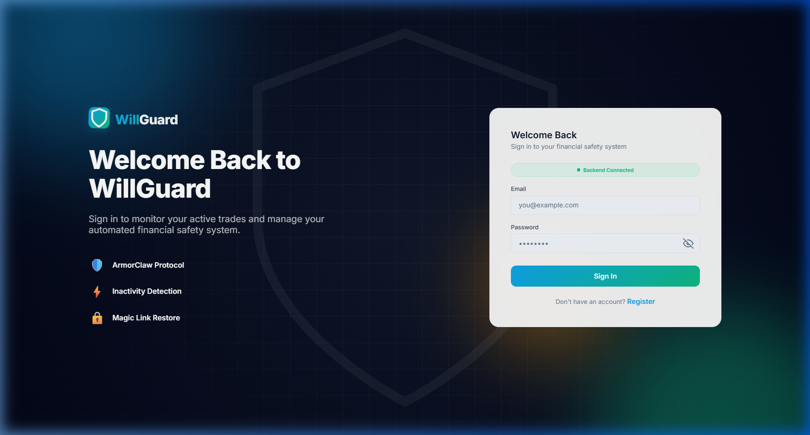
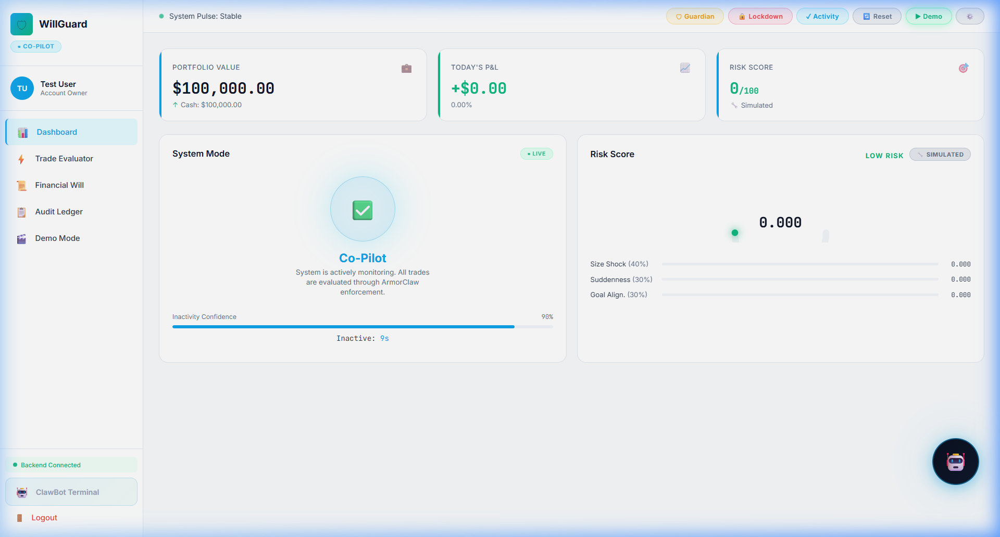
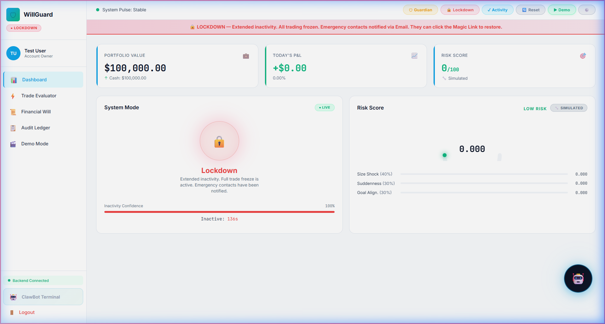

# 🛡 WillGuard — AI-Powered Financial Safety System

> **Protect your assets. Automate your safety. Trade with peace of mind.**

WillGuard is an intelligent financial safety platform that monitors trading activity, detects user inactivity, and automatically enforces protective measures through its proprietary **ArmorClaw Protocol**. When a trader becomes unresponsive, WillGuard progressively locks down their account and alerts emergency contacts with a secure **Magic Link** to restore access.

---

## 📸 Screenshots

### 🔐 Login & Registration

*Split-screen login with animated WillGuard branding, password visibility toggle, and live backend status indicator.*

### 📊 Dashboard — System Mode & Risk Monitoring

*Real-time dashboard showing portfolio value, risk scoring (AI-powered), inactivity monitoring, and system mode transitions.*

### 🤖 ClawBot Terminal

*Hacker-style one-line trade terminal. Type `buy 10 AAPL` or `sell 5 TSLA` — all trades enforced by ArmorClaw.*

---

## 🚀 Features

### 🛡 ArmorClaw Protocol
- **3-Zone Enforcement**: EXECUTE (safe) → NOTIFY (risky) → FREEZE (blocked)
- **AI Risk Scoring** via Google Gemini with heuristic fallback
- **Tone Analysis** on trade messages to detect panic/urgency
- **Per-order limits**, daily volume caps, approved ticker whitelists

### ⏱ Inactivity Detection & Mode Transitions
| Mode | Trigger | Behavior |
|------|---------|----------|
| **Co-Pilot** | Active user | All trades evaluated normally |
| **Guardian** | 10s inactivity* | New trades paused, email alert sent |
| **Lockdown** | 15s inactivity* | All trading frozen, Magic Link sent |

*\*Timers are user-configurable during registration and via the Financial Will settings.*

### 📧 EmailJS Notifications
- Real email alerts sent to emergency contacts on mode changes
- **Magic Link** embedded in every alert — one click to restore the system
- Test alert functionality from the dashboard

### 🤖 ClawBot Terminal
- One-line trade commands: `buy 10 AAPL`, `sell 5 TSLA`
- Live stock quotes: `quote MSFT`
- System status, portfolio view, and reset — all from the terminal
- Every command runs through ArmorClaw enforcement

### 📜 Financial Will
- Set risk tolerance, daily trade limits, per-order limits
- Define approved tickers
- Configure inactivity timer thresholds
- Editable anytime from the dashboard

---

## 🏗 Tech Stack

| Layer | Technology |
|-------|-----------|
| **Frontend** | React + Vite |
| **Backend** | Python FastAPI |
| **Database** | SQLite (persistent) |
| **AI Risk Scoring** | Google Gemini API |
| **Notifications** | EmailJS (with Private Key auth) |
| **Trade Execution** | Alpaca Markets API |
| **Real-time** | WebSocket |

---

## ⚡ Quick Start

### Prerequisites
- **Node.js** (v18+)
- **Python** (3.10+)
- **pip** (Python package manager)

### 1. Clone the Repository
```bash
git clone https://github.com/YOUR_USERNAME/WillGuard.git
cd WillGuard
```

### 2. Backend Setup
```bash
cd backend
pip install -r requirements.txt
```

Create a `.env` file in the `backend/` directory:
```env
# EmailJS Configuration (Required for email alerts)
EMAILJS_SERVICE_ID=your_service_id
EMAILJS_TEMPLATE_ID=your_template_id
EMAILJS_PUBLIC_KEY=your_public_key
EMAILJS_PRIVATE_KEY=your_private_key

# Alpaca API (Optional — simulated if not provided)
ALPACA_API_KEY=your_alpaca_key
ALPACA_SECRET_KEY=your_alpaca_secret

# Google Gemini (Optional — falls back to heuristic scoring)
GEMINI_API_KEY=your_gemini_key
```

Start the backend server:
```bash
python api.py
```
Backend runs at: **http://localhost:8000**

### 3. Frontend Setup
```bash
cd frontend
npm install
npm run dev
```
Frontend runs at: **http://localhost:5173**

### 4. Open in Browser
Navigate to **http://localhost:5173** and register your account!

---

## 🎮 How to Demo

1. **Register** — Create an account with your email and emergency contacts
2. **Trade** — Use the Trade Evaluator or ClawBot terminal (`buy 10 AAPL`)
3. **Wait 10 seconds** — Guardian Mode activates, email sent to contacts
4. **Wait 15 seconds** — Lockdown Mode triggers, Magic Link emailed
5. **Click Magic Link** — System instantly restores to Co-Pilot mode
6. **Run Demo** — Click the ▶ Demo button for an automated walkthrough

---

## 📁 Project Structure

```
WillGuard/
├── backend/
│   ├── api.py                    # FastAPI server & endpoints
│   ├── requirements.txt          # Python dependencies
│   ├── .env                      # Environment variables
│   ├── data/                     # SQLite database
│   └── src/
│       ├── armorclaw/            # ArmorClaw enforcement engine
│       │   ├── enforcer.py       # 3-zone trade enforcement
│       │   └── policy_loader.py  # Financial will policies
│       ├── intelligence/         # AI layer
│       │   ├── risk_scorer.py    # Gemini + heuristic risk scoring
│       │   ├── inactivity_detector.py
│       │   └── tone_classifier.py
│       ├── openclaw/             # Autonomous agent
│       │   ├── agent.py          # Main orchestrator
│       │   ├── heartbeat.py      # Activity monitoring
│       │   └── memory.py         # Markdown-based persistence
│       └── notifications/
│           └── notifier.py       # EmailJS integration
├── frontend/
│   ├── src/
│   │   ├── App.jsx               # Main dashboard
│   │   ├── api.js                # API client
│   │   ├── index.css             # Design system
│   │   └── components/
│   │       ├── Auth.jsx          # Login/Register
│   │       ├── ClawBot.jsx       # Trade terminal
│   │       ├── Engine.jsx        # Mode & threshold logic
│   │       ├── Panels.jsx        # Dashboard panels
│   │       ├── Sections.jsx      # Risk signals, contacts, will
│   │       ├── Toasts.jsx        # Notification toasts
│   │       └── TradeAndLedger.jsx
│   └── package.json
├── screenshots/                  # App screenshots
└── README.md
```

---

## 🔐 Security Architecture

```
┌──────────────────────────────────────────┐
│           OpenClaw Agent                 │
│  ┌────────────────────────────────────┐  │
│  │  Perceive: Heartbeat + Signals     │  │
│  │  Reason:   Risk Score + Tone       │  │
│  │  Act:      Execute or Block        │  │
│  │  Enforce:  ArmorClaw (always)      │  │
│  └────────────────────────────────────┘  │
└──────────────────────────────────────────┘
        │                    │
   Co-Pilot Mode        Guardian Mode
   (Normal Trading)     (Trades Paused)
                             │
                        Lockdown Mode
                      (All Frozen + Alerts)
```

---

## 👥 Team

Built for hackathon demonstration.

---

## 📄 License

MIT License — see [LICENSE](LICENSE) for details.
